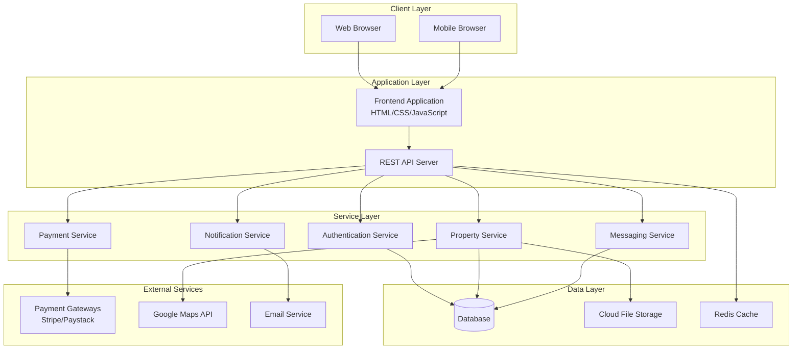

# Design Document

## Overview

House Matters is a web-based rental platform that connects landlords and tenants directly. The system follows a modern web architecture with a responsive frontend, RESTful API backend, secure authentication, integrated payment processing, and cloud-based file storage. The platform emphasizes user experience, security, and scalability to handle growing user bases and property listings.

## Architecture

### High-Level Architecture



### Technology Stack

- **Frontend**: Vanilla JavaScript with modern ES6+ features, CSS Grid/Flexbox for responsive design
- **Backend**: Node.js with Express.js framework for RESTful API
- **Database**: PostgreSQL for relational data with proper indexing
- **Caching**: Redis for session management and frequently accessed data
- **File Storage**: AWS S3 or similar cloud storage for property images
- **Authentication**: JWT tokens with refresh token mechanism
- **Payment Processing**: Stripe and Paystack SDK integration
- **Email**: SendGrid or similar service for transactional emails

## Components and Interfaces

### Frontend Components

#### Authentication Module
- **Login Component**: Handles user authentication with role-based redirects
- **Registration Component**: Separate flows for landlords and tenants with validation
- **Email Verification Component**: Handles account activation process

#### Property Management Module
- **Property Listing Component**: Create and edit property listings with image upload
- **Property Search Component**: Advanced search with filters and map integration
- **Property Detail Component**: Comprehensive property information display

#### Communication Module
- **Messaging Interface**: Real-time messaging between landlords and tenants
- **Booking Component**: Schedule and manage property viewings

#### Payment Module
- **Payment Interface**: Secure payment processing for rent and deposits
- **Transaction History**: Display payment records and receipts

#### User Profile Module
- **Profile Management**: Edit user information and preferences
- **Dashboard Component**: Role-specific dashboards with relevant metrics

### Backend API Endpoints

#### Authentication Endpoints
```
POST /api/auth/register
POST /api/auth/login
POST /api/auth/verify-email
POST /api/auth/refresh-token
POST /api/auth/logout
```

#### Property Endpoints
```
GET /api/properties (with query parameters for search/filter)
POST /api/properties
GET /api/properties/:id
PUT /api/properties/:id
DELETE /api/properties/:id
POST /api/properties/:id/images
```

#### User Endpoints
```
GET /api/users/profile
PUT /api/users/profile
GET /api/users/:id/reviews
POST /api/users/:id/reviews
```

#### Messaging Endpoints
```
GET /api/messages
POST /api/messages
GET /api/conversations/:id
POST /api/bookings
PUT /api/bookings/:id
```

#### Payment Endpoints
```
POST /api/payments/create-intent
POST /api/payments/confirm
GET /api/payments/history
POST /api/payments/webhooks
```

## Data Models

### User Model
```javascript
{
  id: UUID,
  email: String (unique),
  password: String (hashed),
  role: Enum ['landlord', 'tenant'],
  firstName: String,
  lastName: String,
  phone: String,
  isVerified: Boolean,
  profileImage: String (URL),
  createdAt: DateTime,
  updatedAt: DateTime
}
```

### Property Model
```javascript
{
  id: UUID,
  landlordId: UUID (foreign key),
  title: String,
  description: Text,
  address: String,
  city: String,
  state: String,
  rent: Decimal,
  bedrooms: Integer,
  bathrooms: Integer,
  amenities: Array[String],
  images: Array[String] (URLs),
  isAvailable: Boolean,
  latitude: Decimal,
  longitude: Decimal,
  createdAt: DateTime,
  updatedAt: DateTime
}
```

### Message Model
```javascript
{
  id: UUID,
  senderId: UUID (foreign key),
  receiverId: UUID (foreign key),
  propertyId: UUID (foreign key, optional),
  content: Text,
  isRead: Boolean,
  createdAt: DateTime
}
```

### Booking Model
```javascript
{
  id: UUID,
  tenantId: UUID (foreign key),
  propertyId: UUID (foreign key),
  requestedDate: DateTime,
  status: Enum ['pending', 'confirmed', 'cancelled'],
  notes: Text,
  createdAt: DateTime,
  updatedAt: DateTime
}
```

### Payment Model
```javascript
{
  id: UUID,
  tenantId: UUID (foreign key),
  landlordId: UUID (foreign key),
  propertyId: UUID (foreign key),
  amount: Decimal,
  type: Enum ['deposit', 'rent'],
  status: Enum ['pending', 'completed', 'failed'],
  paymentGateway: Enum ['stripe', 'paystack'],
  transactionId: String,
  createdAt: DateTime
}
```

### Review Model
```javascript
{
  id: UUID,
  reviewerId: UUID (foreign key),
  revieweeId: UUID (foreign key),
  propertyId: UUID (foreign key, optional),
  rating: Integer (1-5),
  comment: Text,
  createdAt: DateTime
}
```

## Error Handling

### Frontend Error Handling
- **Network Errors**: Display user-friendly messages for connection issues
- **Validation Errors**: Real-time form validation with clear error messages
- **Authentication Errors**: Automatic token refresh and login prompts
- **File Upload Errors**: Progress indicators and retry mechanisms

### Backend Error Handling
- **Input Validation**: Comprehensive validation using middleware (e.g., Joi)
- **Database Errors**: Proper error logging and generic user messages
- **Payment Errors**: Detailed error codes from payment gateways with user-friendly translations
- **Rate Limiting**: Implement rate limiting to prevent abuse
- **Global Error Handler**: Centralized error handling middleware

### Error Response Format
```javascript
{
  success: false,
  error: {
    code: "VALIDATION_ERROR",
    message: "User-friendly error message",
    details: {} // Additional error details for debugging
  }
}
```

## Testing Strategy

### Frontend Testing
- **Unit Tests**: Test individual components and utility functions using Jest
- **Integration Tests**: Test component interactions and API integration
- **E2E Tests**: Use Playwright or Cypress for critical user journeys
- **Accessibility Testing**: Automated accessibility testing with axe-core

### Backend Testing
- **Unit Tests**: Test individual functions and middleware using Jest
- **Integration Tests**: Test API endpoints with test database
- **Load Testing**: Performance testing for high-traffic scenarios
- **Security Testing**: Test for common vulnerabilities (SQL injection, XSS)

### Test Coverage Goals
- Minimum 80% code coverage for critical business logic
- 100% coverage for payment processing functions
- Comprehensive testing of authentication and authorization flows

### Testing Environment
- **Test Database**: Separate PostgreSQL instance for testing
- **Mock Services**: Mock external APIs (payment gateways, email service)
- **CI/CD Pipeline**: Automated testing on every pull request
- **Staging Environment**: Production-like environment for final testing

## Security Considerations

### Authentication & Authorization
- JWT tokens with short expiration times and refresh token rotation
- Role-based access control (RBAC) for landlord/tenant features
- Password hashing using bcrypt with appropriate salt rounds
- Email verification required before account activation

### Data Protection
- HTTPS enforcement for all communications
- Input sanitization to prevent XSS attacks
- SQL injection prevention using parameterized queries
- File upload validation and virus scanning

### Payment Security
- PCI DSS compliance through payment gateway integration
- No storage of sensitive payment information
- Webhook signature verification for payment confirmations
- Secure handling of payment gateway API keys

### Privacy & Compliance
- GDPR compliance for user data handling
- Clear privacy policy and terms of service
- User consent management for data processing
- Right to data deletion and export functionality